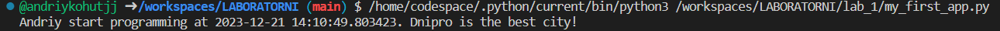
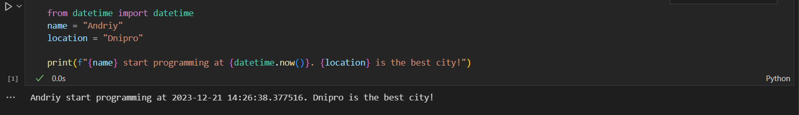
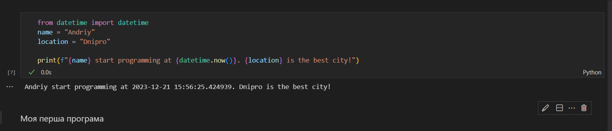
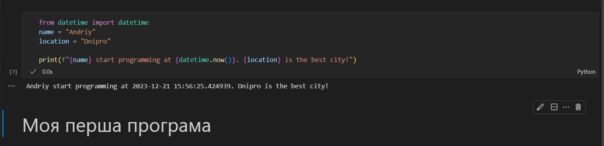
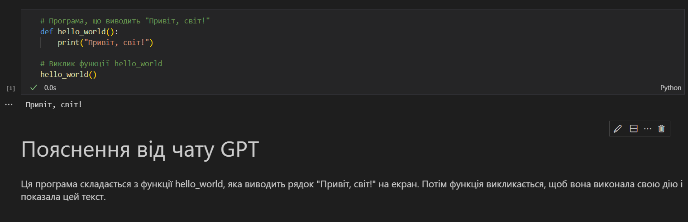

# Звіт до роботи 1
## Тема: Перша програма на Python
### Мета роботи: створити першу програму на Python

---
### Виконання роботи
* Результати виконання завдання *1*;
    1. Створив перший файл з розшишенням .py
    2. Програма вивела значення: Andriy start programming at 2023-12-21 14:10:49.803423. Dnipro is the best city!
    3. Отримано наступні результати: відображено дані, коли я запустив програму, за допомогою функції "datetime.now", а також моє улюблене місто, котре я вказав в коді.
    4. Навчився створювати файл Python.
* вставлені рисунки (скріншоти екрана або фотографії виконаного завдання у зошиті);

* Результати виконання завдання *2*;
    1. Створив перший файл з розшишенням .ipynb
    2. Програма вивела значення: Andriy start programming at 2023-12-21 14:26:38.377516. Dnipro is the best city!
    3. Отримано наступні результати: відображено дані, коли я запустив програму, за допомогою функції "datetime.now", а також моє улюблене місто, котре я вказав в коді.
    4. Навчився створювати файл з розширенням .ipynb.
* вставлені рисунки (скріншоти екрана або фотографії виконаного завдання у зошиті);

* Результати виконання завдання *3*;
    1. Створив ще одну комірку з типом Markdown
    2. Програма вивела значення: Andriy start programming at 2023-12-21 14:26:38.377516. Dnipro is the best city! Моя перша програма (звичайним текстом).
    3. Перетворив звичайний текст на заголовок
    4. Програма вивела значення: Andriy start programming at 2023-12-21 14:26:38.377516. Dnipro is the best city! Моя перша програма (заголовком).
    4. Навчився користуватися Python Notebook.
* вставлені рисунки (скріншоти екрана або фотографії виконаного завдання у зошиті);

* Результати виконання завдання *4*;
    Запитав у чата GPT, яку б першу програму написав АІ та чи б міг АІ пояснити її. Створив файл з розширенням .ipynb, де вставив цю програму та пояснення чата.
* вставлені рисунки (скріншоти екрана або фотографії виконаного завдання у зошиті);

---
### Висновок:
> у висновку потрібно відповісти на запитання:

- :question: Що зроблено в роботі; 
    Я створив першу програму з різними розширеннями на Python 
- :question: Чи досягнуто мети роботи;
    Так, мету роботи досягнено.
- :question: Які нові знання отримано;
    Робота з плагінами, створення та виконання програм, робота у Jupyter Notebook.
- :question: Чи вдалось відповісти на всі питання задані в ході роботи;
    Так
- :question: Чи вдалося виконати всі завдання;
    Так
- :question: Чи виникли складності у виконанні завдання;
    Ні

---
