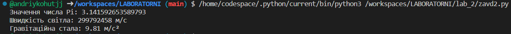
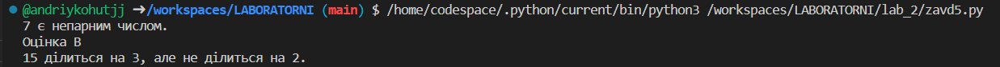

# Звіт до роботи 2
## Тема: Основні конструкції в Python
### Мета роботи: Ознайомитися з основними конструкціями в Python

---
### Виконання роботи
* Результати виконання завдання;
Створив файл Python *.pyабо .ipynb, в якому виконав базові приклади. Застосовуючи команду, print виконав наступне:
    1. Познайомився з основними типами даних . Попрактикувався з простими змінними, списками list, наборами setта словниками dict.
    
    

    1. Ввів вбудовані константи.
    
    

    1. Ввів результат роботи вбудованих функцій.
    
    

    1. Познайомився з циклами. Написав коди, які демонструють робочі цикли.
    
    

    1. Познайомився з розгалуженнями . Написав коди, які демонструють роботу розгалужень.
    
    

    1. Написав свій варіант коду з помилкою. 
    
    
    

    1. Написав свій код з контекст-менеджером.
    
    

    1. Познайомився з лямбдами Python . Написав свій приклад коду та вирішення Лямбди.
    
    

Запитав у ChatGPT, як би він розписав про основи Python. Спробував виконати його приклади коду Python та вставив його відповіді у звіт:
Основи Python - це основні концепції та конструкції мови, які слід знати кожному початківцеві. Ось декілька базових конструкцій та прикладів, які корисно знати:
    1. Змінні та типи даних:
    
    
    1. Оператори умови:
    
    
    1. Цикли:
    
    
    1. Функції:
    
    
    1. Списки та словники:
    
    
    1. Виключення (Exceptions):
    
    

---
### Висновок:

- :question: Що зроблено в роботі: досліджено основні конструкції в Python
- :question: Чи досягнуто мети роботи: Так, мету роботи досягнуто.
- :question: Які нові знання отримано: Навчився використовувати основні типи даних, ознайомився з вбудованими функціями, умовами, циклами, розгалуженнями, контекст-менеджером та з лямбдами Python.
- :question: Чи вдалось відповісти на всі питання задані в ході роботи;
    Так
- :question: Чи вдалося виконати всі завдання;
    Так
- :question: Чи виникли складності у виконанні завдання;
    Ні

---
