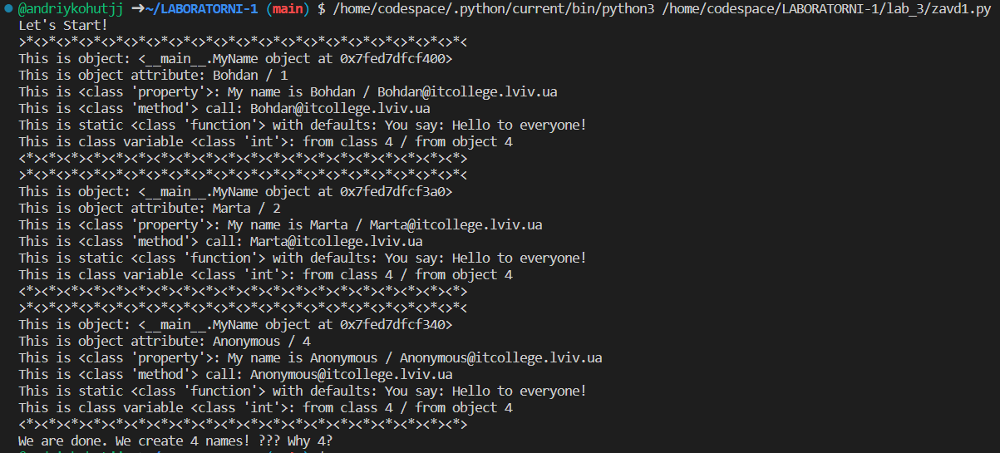
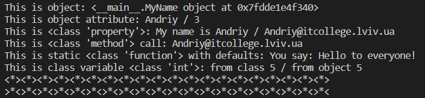
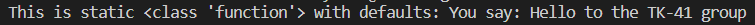
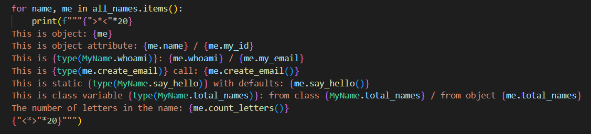
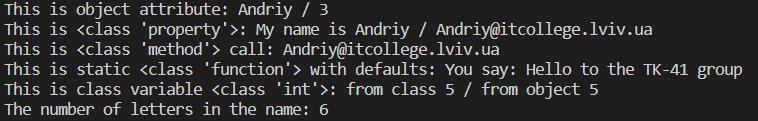

# Звіт до роботи 3
## Тема: Знайомство з ООП
### Мета роботи: Навчитись створювати перший клас

---
### Виконання роботи
* Результати виконання завдання;
    1. Створив файл з розширенням .py
    1. Скопіював код у файл та запустив його. Програма вивела ім'я троьх учнів ІТ-коледжу з їхніми даними.
    * вставлені рисунки (скріншоти екрана або фотографії виконаного завдання у зошиті);
    
    1. Ознайомився з кодом та спробуйвав зрозуміти, за що відповідає кожнен з рядків. Після проходження всіх матеріалів з лекцій Ви повинні розумів, що робить даний клас;
    1. Модифікував програму, додавши своє ім'я в список;
    * вставлені рисунки (скріншоти екрана або фотографії виконаного завдання у зошиті);
    
    1. Дав відповіді на запитання: 
    - Чому коли передаємо значення `None` створюється обєкт з іменем `Anonymous`?
     У конструкторі __init__ класу MyName відбувається перевірка наявності імені. Якщо значення name дорівнює None, тоді викликається метод anonymous_user(), який створює об'єкт з іменем "Anonymous".

    - Як змінити текст привітання при виклику методу `say_hello()`? Допишіть цю частину коду.
     Щоб змінити текст привітання, необхідно змінити текст message у say_hello(). Наприклад, можемо змінити повідомлення "Hello to everyone!" на "Hello to the TK-41 group!".
     * вставлені рисунки (скріншоти екрана або фотографії виконаного завдання у зошиті);
     

    - Дописав функцію в класі яка порахує кількість букв і імені;
        * вставлені рисунки (скріншоти екрана або фотографії виконаного завдання у зошиті);
        
        
        

    - Порахуйте кількість імен у списку `names` та порівняйте із виведеним результатом. Дайте відповідь чому маємо різну кількість імен?
    У списку є 3 ім'я, але значення None призводить до створення об'єкту з ім'ям "Anonymous", тому система видає нам дані 4-ьох студентів.

---
### Висновок:

- :question: Що зроблено в роботі: Розглянуто роботу класів
- :question: Чи досягнуто мети роботи: Так, мету роботи досягнено
- :question: Які нові знання отримано: Отримано знання, як створити перший клас
- :question: Чи вдалось відповісти на всі питання задані в ході роботи:
    Так
- :question: Чи вдалося виконати всі завдання:
    Так
- :question: Чи виникли складності у виконанні завдання:
    Ні

---
