# Звіт до роботи 4
## Тема: Віртуальні середовища
### Мета роботи: Ознайомитися з віртуальними середовищами

---
### Виконання роботи
* Результати виконання завдання 1;
    1. Перевірив, чи встановлений інструмент PIP, та передивився дії, які можна зробити за допомогою pip
    * вставлені рисунки (скріншоти екрана або фотографії виконаного завдання у зошиті);
    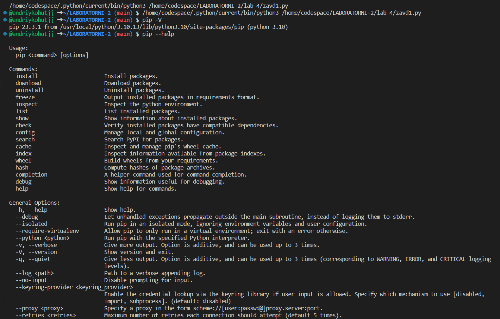
    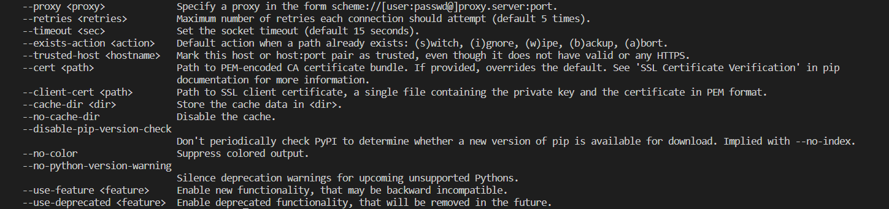
    1. Встановив бібліотеку requests
    * вставлені рисунки (скріншоти екрана або фотографії виконаного завдання у зошиті);
    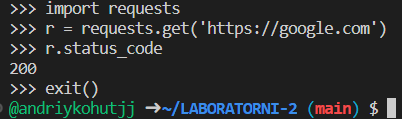
    1. Встановив бібліотеку requests==2.1 та видалив її.
    * вставлені рисунки (скріншоти екрана або фотографії виконаного завдання у зошиті);
    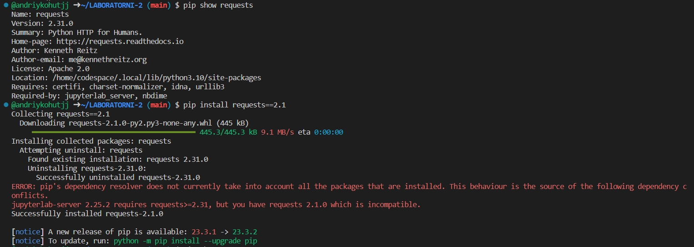
    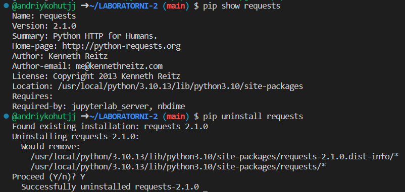

* Результати виконання завдання 2;
    1. Для створення VENV та його активації виконав команди:
    * вставлені рисунки (скріншоти екрана або фотографії виконаного завдання у зошиті);
    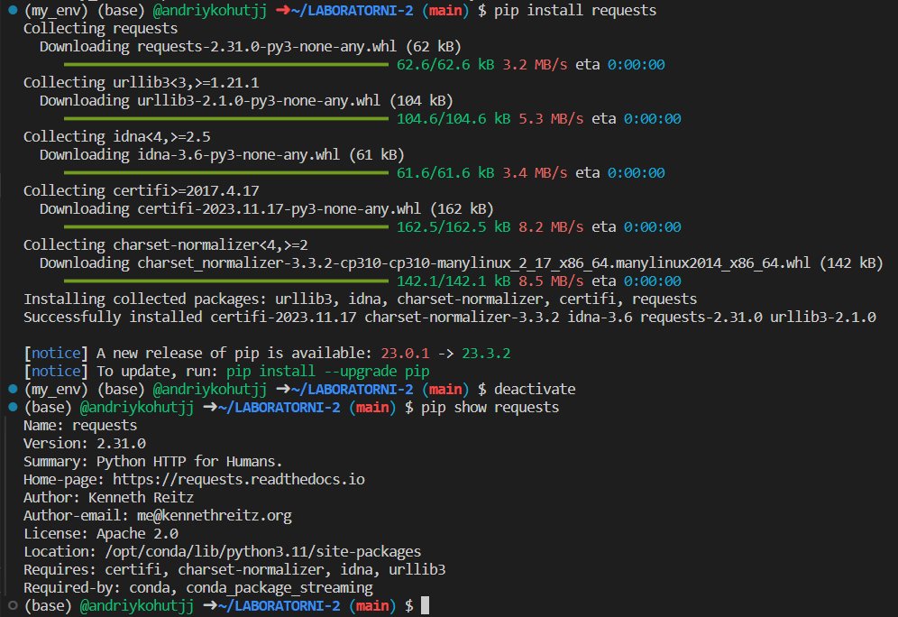
    1. Остання команда вивела інформацію про встановлений пакет requests, включаючи версію, автора, ліцензію, місцезнаходження у системі, список залежностей та пакети, які вимагають наявності цього пакету, оскільки ми викликали цю функцію.

* Результати виконання завдання 3;
    1. Інсталював інструмент Pipenv та вивів команди, які можна виконувати за допомогою pipenv
    * вставлені рисунки (скріншоти екрана або фотографії виконаного завдання у зошиті);
    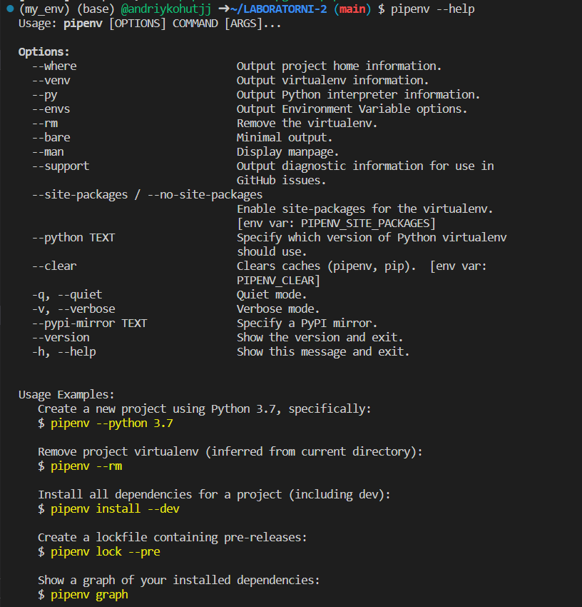
    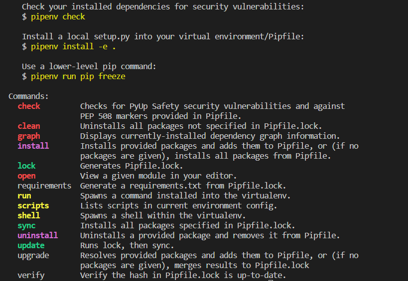

    1. Створив нове середовище та інсталював бібліотеки
    * файл pipfile
    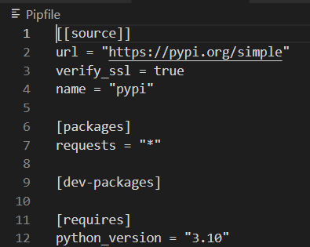
    * файл pipfile.lock
    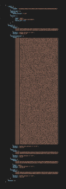

    1. Створив файл zavd.py та додав у нього програму. Запустив її та отримав такі результати (через командний рядок програма запускалася та одразу закривалася):
    * вставлені рисунки (скріншоти екрана або фотографії виконаного завдання у зошиті);
    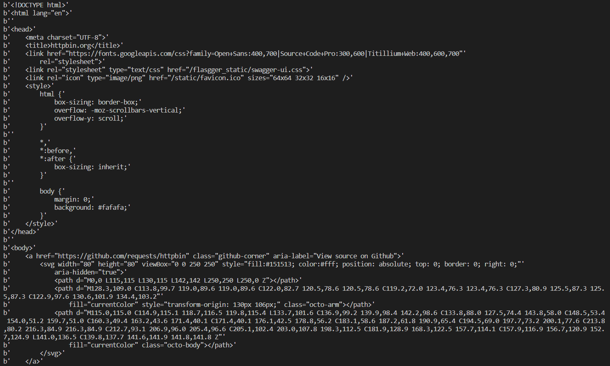

    1. Обрав рекомендований інтерпретатор та виконав скрипт через кнопку Run
    * вставлені рисунки (скріншоти екрана або фотографії виконаного завдання у зошиті);
    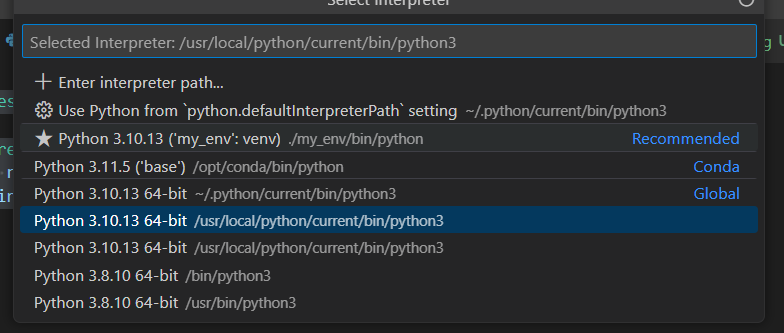
    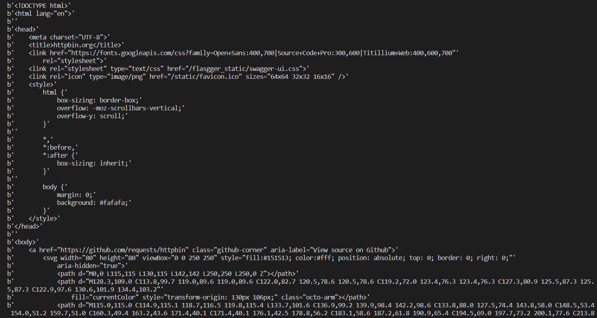

* Результати виконання завдання 4;
    1. Створив файл з розширенням .env та виконав заданий код:
    * вставлені рисунки (скріншоти екрана або фотографії виконаного завдання у зошиті);
    Без активації віртуального середовища отримання значення змінної HELLO завершується помилкою.

---
### Висновок:
> у висновку потрібно відповісти на запитання:

- :question: Що зроблено в роботі: ознайомлено з віртуальними середовищами
- :question: Чи досягнуто мети роботи: так, мету досягнуто
- :question: Які нові знання отримано: отримано знання у роботі з віртуальними середовщами
- :question: Чи вдалось відповісти на всі питання задані в ході роботи: так
- :question: Чи вдалося виконати всі завдання: так
- :question: Чи виникли складності у виконанні завдання: ні
---
