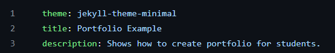
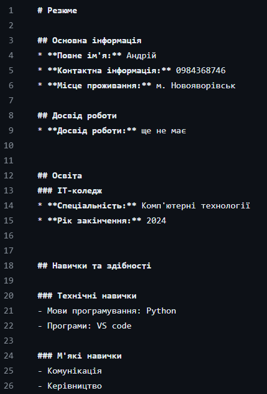
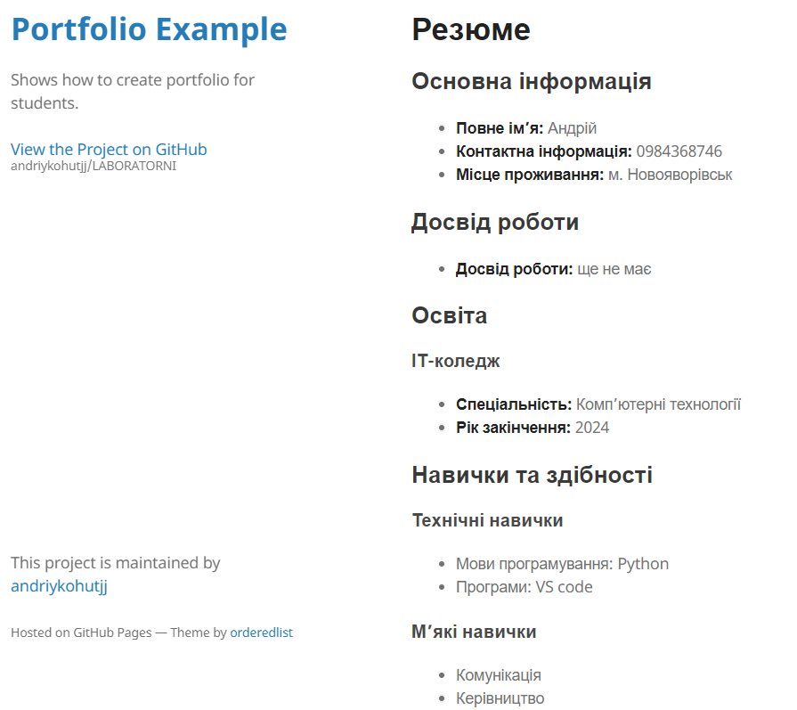

# Звіт до роботи 1
## Тема: Створення портфоліо за допомогою GitHub Page
### Мета роботи: Створити портфоліо за допомогою GitHub Page

---
### Виконання роботи
* Результати виконання завдання;
    1. Щоб увімкнути сторінки GitHub, перейшов до Settings, далі вибрав Pages. Вказав, з якої гілки буде відображатися вміст файлу, для цього вибрав гілку main, папку /doc та натиснув «Зберегти».
    1. Змінив заголовок та опис сайту та для привабливішого вигляду використав тему:
    * вставлені рисунки (скріншоти екрана або фотографії виконаного завдання у зошиті);
    
    1. Щоб наповнити сторінку, я запитався у ChatGPT як би він оформив головну сторінку та щоб написав.
    * вставлені рисунки (скріншоти екрана або фотографії виконаного завдання у зошиті);
    

* Вигляд резюме;
    * вставлені рисунки (скріншоти екрана або фотографії виконаного завдання у зошиті);
    

---
### Висновок:
> у висновку потрібно відповісти на запитання:

- :question: Що зроблено в роботі: створено портфоліо за допомогою GitHub Page
- :question: Чи досягнуто мети роботи: так, досягнуто
- :question: Які нові знання отримано: отримано нові знання у створенні статичних Web сторінок
- :question: Чи вдалось відповісти на всі питання задані в ході роботи: так
- :question: Чи вдалося виконати всі завдання: так
- :question: Чи виникли складності у виконанні завдання: так

